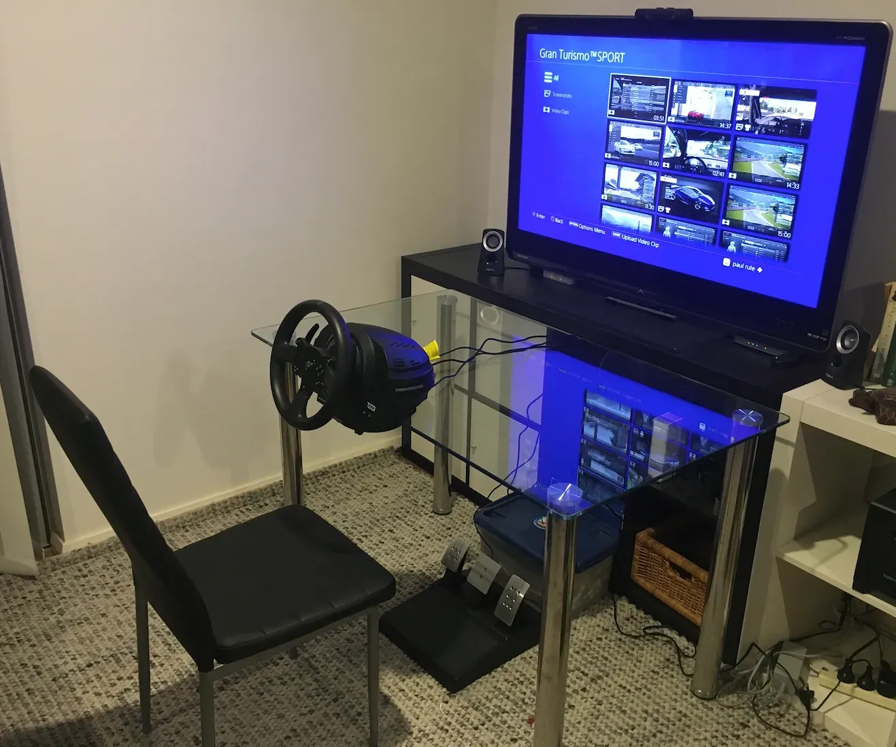

I’ve always liked racing games, but never been any good at them. Sitting on the couch, playing F1 2020 on the PS4 with the standard controller has always been a lesson in frustration with a little enjoyment.

So, the time had come to give it a proper try. I did a little bit of research and opted to go for the Thrustmaster T300 RS GT Edition. This comes with the T3PA — GT Edition Pedal Set and is a mid-level steering wheel. There are less expensive options, and there are more expensive options.

In this case, the Thrustmaster cost more than the PS4, but I’m hoping it’ll give me a good enough experience.

After ordering it online (couldn’t pick it up due to COVID lockdowns!) I set up an old table in front of the old 46 inch LCD TV. This is NOT an optimal setup, but this is where I’m starting and perhaps if I enjoy it enough I’ll look into some improvements.

After just over a week, I can definitely say that using a steering wheel and pedals is a much more enjoyable experience than the PS4 controller. It’s much easier to make subtle steering, braking, and acceleration changes and I can more accurately follow the optimal driving line and easily do laps without crashing (unless I’m chasing lap times too hard). This makes for much more fun!

Now, I just need to learn how to drive…

https://youtu.be/lfGjtivHb-o
